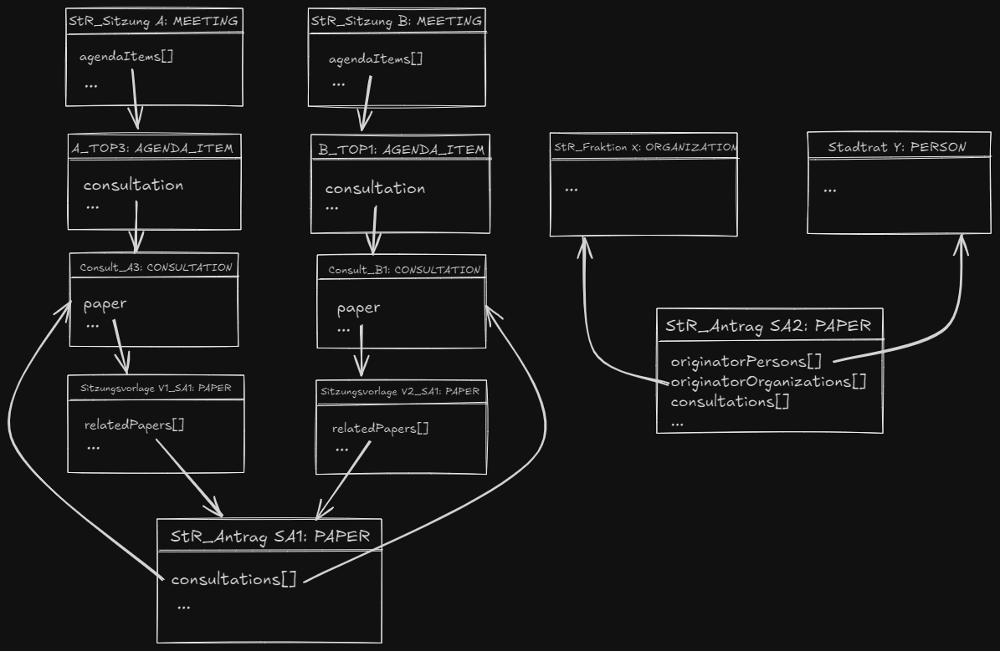

# Datenmodell für die Abbildung von RIS

## Status

Vorgeschlagen

## Kontext

Das RIS (Rat-Informations-System) verwaltet verschiedene gesetzgeberische Prozesse, einschließlich Sitzungen, Tagesordnungspunkte, Anträge und Dokumente. Das Ziel dieses ADR ist es, zu definieren, wie die Datenstrukturen innerhalb des RIS für uns am besten dargestellt werden können. Eine Möglichkeit ist OParl. OParl ist eine standardisierte API für öffentliche Daten parlamentarischer Prozesse, die die Zugänglichkeit und Interoperabilität von Regierungsdaten verbessert.

## Mapping RIS auf Oparl

| **RIS Entität**              | **OParl Entität**    |
|------------------------------|----------------------|
| STR_SITZUNG                  | MEETING              |
| TAGESORDNUNGSPUNKT           | AGENDA_ITEM          |
| VORGANG                      | PAPER                |
| DOKUMENT                     | FILE                 |
| ANTRAG                       | PAPER                |
| BV_Empfehlung                | PAPER                |
| SITZUNGSVORLAGE              | PAPER                |
| AUSSCHUSS                    | ORGANIZATION         |
| MITGLIEDER                   | PERSON               |
| Wahlperiode                  | LEGISLATIVE_TERM     |
| indirekt über Vorsitz, Fraktionszugehörigkeit, etc... |MEMBERSHIP |
| jegliche Ortsangaben         | LOCATION             |
|                              | CONSULTATION         |
| (nur bei Oparl Schnittstelle)| BODY                 |
| (nur bei Oparl Schnittstelle)| SYSTEM               |

A city council MEETING (StR_Sitzung) has multiple AGENDA_ITEMs of which each can have a Sitzungsvorlage or "Beschlussvorlage" (PAPER with accompanying FILE). This relates to one or multiple StR_Antrag or BV_Empfehlung (different type of PAPER). So these will for now be modeled via the relationship relatedPaper. The consultation about those will result in the AGENDA_ITEM's result str, resolutionText, and resolutionFile. A StR_Antrag that wasn't consulted about yet (i.e. when being created) will only exist in its relation to its initiating originatorPersons and/or originatorOrganizations.
An AGENDA_ITEM can probably consult about only parts of a StR_Antrag and the decision about it (result) can be delayed, so multiple AGENDA_ITEMs can relate to the same StR_Antrag/BV_Empfehlung. That fact is modeled by the list of CONSULTATIONs that the PAPER (= StR_Antrag in that case) contains.

## Paper Typen

| **Typ Bezeichnung**     |
|-------------------------|
| Str-Antrag              |
| BA-Antrag               |
| Sitzungsvorlage         |
| BV-Empfehlung           |
| BV-Anfrage              |

### Subtypen

#### Str-Antrag

| **Typ Bezeichnung**     |
|-------------------------|
| Dringlichkeitsantrag    |
| Antrag                  |
| Anfrage                 |
| Änderungsantrag         |

#### BA-Antrag

| **Typ Bezeichnung**     |
|-------------------------|
| BA-Antrag               |

#### BV-Empfehlung

| **Typ Bezeichnung**     |
|-------------------------|
| BV-Empfehlung           |

#### BV-Anfrage

| **Typ Bezeichnung**     |
|-------------------------|
| BV-Anfrage              |

#### Sitzungsvorlage

| **Typ Bezeichnung**     |
|-------------------------|
| Beschlussvorlage VB     |
| Beschlussvorlage SB     |
| Beschlussvorlage SB+VB  |
| Bekanntgabe             |
| Direkt                  |
| Sitzungsvorlage zur DA  |
